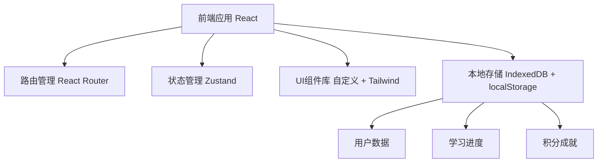
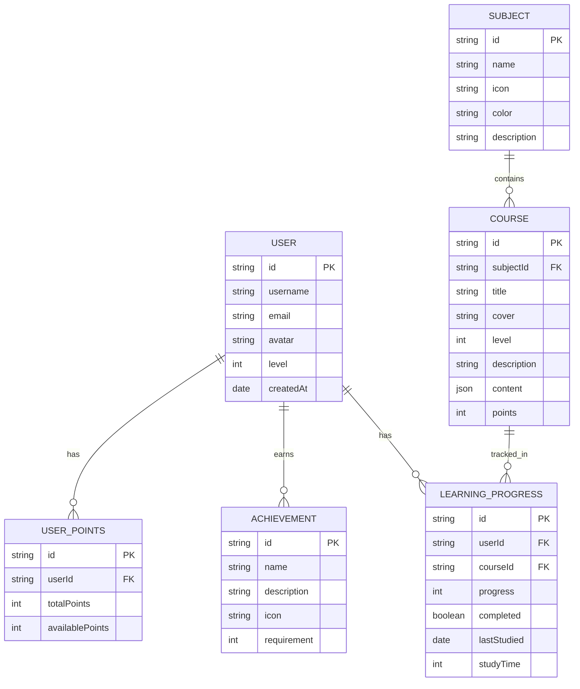

## 1. Architecture Design
纯前端 + 本地存储架构，无需后端服务器，支持离线运行，数据存储在浏览器本地。

## 2. Technology Description
- **Frontend**: React@18 + TypeScript + TailwindCSS@3 + Vite
- **State Management**: Zustand
- **Routing**: React Router DOM
- **Storage**: IndexedDB (dexie.js) + localStorage
- **Local Server**: Vite dev server (支持离线访问)
- **Containerization**: Docker (多架构支持: armv7, arm64, x86_64)

## 3. Route Definitions
| Route | Purpose |
|-------|---------|
| / | 首页 - 学科导航、热门课程 |
| /subject/:id | 学科课程列表页 |
| /course/:id | 课程详情与学习页 |
| /learning | 学习中心 - 进度追踪 |
| /achievements | 成就系统 - 积分商城 |
| /profile | 个人中心 - 账号管理 |
| /login | 登录页 |
| /register | 注册页 |

## 4. Data Model
### 4.1 Data Model Definition

### 4.2 Data Initialization
- 使用本地数据初始化课程内容
- 预置四大科目（语文、数学、英语、科学）
- 每个科目包含5个难度等级的课程
- 预置成就徽章系统

## 5. Key Components
| Component | Purpose |
|-----------|---------|
| SubjectCard | 学科卡片展示 |
| CourseCard | 课程卡片展示 |
| ProgressRing | 环形进度条 |
| InteractiveLesson | 互动学习模块 |
| AchievementBadge | 成就徽章 |
| ShopItem | 积分商城商品 |
| NavBar | 底部导航栏 |

## 6. Docker Configuration
- 基础镜像: node:18-alpine (多架构)
- 构建阶段: 安装依赖 → 构建应用 → 生产镜像
- 运行: 启动静态文件服务器 (serve)
- 支持架构: linux/amd64, linux/arm64, linux/arm/v7
- 数据持久化: 挂载本地存储目录
