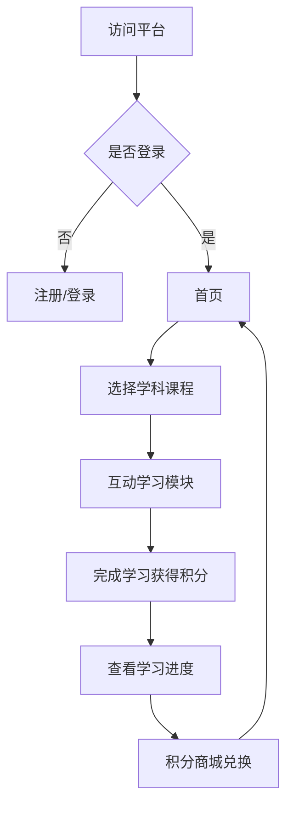

## 1. Product Overview
面向4-8岁小朋友的多学科在线教育平台，提供语文、数学、英语、科学等课程，打造沉浸式学习体验。
- 解决低龄儿童在线学习缺乏趣味性和系统性的问题，激发学习兴趣
- 打造一站式儿童教育解决方案，支持多种设备访问和离线本地运行

## 2. Core Features

### 2.1 User Roles
| Role | Registration Method | Core Permissions |
|------|---------------------|------------------|
| 小朋友/学生 | 家长邮箱注册 | 浏览课程、参与学习、获得成就 |
| 家长 | 邮箱/手机号注册 | 管理孩子账号、查看学习进度、设置偏好 |

### 2.2 Feature Module
1. **首页**：学科导航、热门课程、学习进度展示
2. **课程页面**：分级课程列表、课程详情、互动学习模块
3. **学习中心**：学习进度追踪、个性化学习路径
4. **成就系统**：积分商城、成就徽章、排行榜
5. **个人中心**：用户信息、账号管理、设置

### 2.3 Page Details
| Page Name | Module Name | Feature description |
|-----------|-------------|---------------------|
| 首页 | 学科导航 | 语文、数学、英语、科学四大板块，卡通图标展示 |
| 首页 | 热门课程 | 推荐适合当前等级的课程卡片 |
| 首页 | 学习进度 | 可视化进度条，显示今日学习时长 |
| 课程页面 | 分级课程体系 | 按难度等级（L1-L5）分类展示课程 |
| 课程页面 | 互动学习模块 | 拖拽、点击、动画等交互形式 |
| 学习中心 | 进度追踪 | 展示各学科学习时长、完成课程数、掌握知识点 |
| 学习中心 | 个性化推荐 | 基于学习数据推荐适合的课程 |
| 成就系统 | 积分商城 | 用积分兑换虚拟奖品、装饰等 |
| 成就系统 | 成就徽章 | 完成学习目标获得徽章 |
| 个人中心 | 账号管理 | 登录、注册、个人信息编辑 |

## 3. Core Process
用户访问平台 → 注册/登录 → 首页浏览 → 选择学科课程 → 进入互动学习 → 完成学习获得积分 → 查看学习进度 → 兑换商城奖品

## 4. User Interface Design
### 4.1 Design Style
- **主色调**：明亮欢快的彩虹色系（橙黄、天空蓝、樱花粉、薄荷绿）
- **次色调**：白色背景搭配柔和渐变
- **按钮风格**：圆润3D按钮，带弹跳动画效果
- **字体**：圆润可爱的中文字体，大号字号，高对比度
- **布局风格**：卡片式布局，大图标，充足留白
- **图标风格**：卡通手绘风格，色彩丰富
- **动画效果**：流畅的过渡动画、弹跳效果、飘带装饰

### 4.2 Page Design Overview
| Page Name | Module Name | UI Elements |
|-----------|-------------|-------------|
| 首页 | 学科导航 | 大圆角卡片、卡通图标、彩虹渐变背景、悬停放大动画 |
| 课程页面 | 课程列表 | 可爱封面图、星级难度标识、进度条展示 |
| 学习中心 | 进度展示 | 彩色环形进度条、数据可视化图表、卡通角色 |
| 成就系统 | 积分商城 | 商品卡片、金币动画、弹窗特效 |
| 个人中心 | 账号界面 | 头像挂件、设置面板、简洁表单 |

### 4.3 Responsiveness
- 移动优先设计，适配手机（360px-768px）、平板（768px-1024px）、TV（1024px+）、PC（1024px+）
- 触摸优化：大点击区域（≥44px），适合小朋友操作
- 横屏/竖屏自适应布局

### 4.4 Animation Guidance
- 页面加载：渐入效果 + 元素依次滑入
- 按钮交互：点击时缩放 + 弹跳
- 学习完成：庆祝动画（彩带、星星飘落）
- 导航切换：平滑翻页效果
